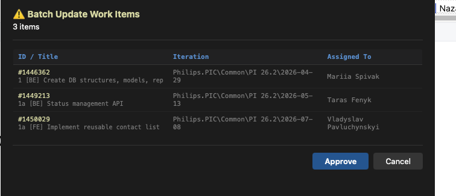

# Azure DevOps Confirmation Hook for Claude Code

A native macOS confirmation dialog for Azure DevOps MCP write operations in Claude Code. Shows a rich visual diff of what's about to change before you approve.

## The Problem

When using the [Azure DevOps MCP server](https://github.com/anthropics/azure-devops-mcp) with Claude Code, write operations (create, update, delete work items, link items, create PRs) execute immediately without visual confirmation. You see the raw JSON in the terminal and have to trust that the right thing is happening.

This is risky when:
- Updating work items in bulk (wrong iteration? wrong assignee?)
- Creating tickets from planning docs (did the description parse correctly?)
- Modifying existing tickets (what's the current value vs what's changing?)

## The Solution

A pre-tool-use hook that intercepts Azure DevOps MCP write operations and shows a **native macOS WebView dialog** with:

- **Single updates:** Side-by-side diff with word-level highlighting (current vs new)
- **Batch updates:** Table view showing all items with old → new values per field
- **Create operations:** Field summary of what's being created
- **Link operations:** List of items being linked with relationship types
- **All other operations:** Formatted payload view

The dialog appears on your **current desktop** (no Space switching), stays on top, and supports keyboard shortcuts (Enter = Approve, Escape = Cancel).



## Features

- **Word-level diff** for single work item updates — changed words highlighted in red (removed) and green (added)
- **Batch update table** — shows ID, title, and old → new for each field being changed
- **Live data fetch** — pulls current values from Azure DevOps API before showing the diff (single call for updates, batch call for bulk)
- **Smart name normalization** — converts emails and "Last, First (Suffix)" formats to readable "First Last"
- **Dark theme** — matches the terminal aesthetic
- **No desktop switching** — window appears on whichever screen your cursor is on
- **Keyboard shortcuts** — Enter to approve, Escape to cancel
- **Supports all MCP operations:** create, update, batch update, link, comment, PR, and generic fallback

## Prerequisites

- **macOS** (uses native Cocoa WebView)
- **Swift compiler** (`swiftc` — comes with Xcode Command Line Tools)
- **Python 3** (`/usr/bin/python3` — ships with macOS)
- **jq** and **curl** (for the shell script)
- [Azure DevOps MCP server](https://github.com/anthropics/azure-devops-mcp) configured in Claude Code

## Installation

### 1. Copy hook files to your project

```bash
mkdir -p .claude/hooks
cp hooks/ado-confirm.sh .claude/hooks/
cp hooks/ado-confirm-dialog.py .claude/hooks/
cp hooks/ado-webview.swift .claude/hooks/
chmod +x .claude/hooks/ado-confirm.sh
chmod +x .claude/hooks/ado-confirm-dialog.py
```

### 2. Compile the Swift WebView binary

```bash
swiftc -framework Cocoa -framework WebKit -O \
  -o .claude/hooks/ado-webview \
  .claude/hooks/ado-webview.swift
```

### 3. Add the binary to .gitignore

```bash
echo ".claude/hooks/ado-webview" >> .gitignore
```

### 4. Configure the hook in Claude Code settings

Add this to your `.claude/settings.local.json` (or project-level settings):

```json
{
  "hooks": {
    "PreToolUse": [
      {
        "matcher": "mcp__azure-devops__wit_create_work_item|mcp__azure-devops__wit_update_work_item|mcp__azure-devops__wit_update_work_items_batch|mcp__azure-devops__wit_add_child_work_items|mcp__azure-devops__wit_add_work_item_comment|mcp__azure-devops__wit_update_work_item_comment|mcp__azure-devops__repo_create_pull_request|mcp__azure-devops__repo_update_pull_request|mcp__azure-devops__repo_create_pull_request_thread|mcp__azure-devops__repo_reply_to_comment|mcp__azure-devops__wit_work_items_link|mcp__azure-devops__wit_work_item_unlink|mcp__azure-devops__wit_link_work_item_to_pull_request|mcp__azure-devops__wit_add_artifact_link|mcp__azure-devops__wiki_create_or_update_page|mcp__azure-devops__pipelines_run_pipeline|mcp__azure-devops__repo_create_branch",
        "hooks": [
          {
            "type": "command",
            "command": ".claude/hooks/ado-confirm.sh",
            "timeout": 30000,
            "statusMessage": "Awaiting confirmation for Azure DevOps action..."
          }
        ]
      }
    ]
  }
}
```

### 5. Configure your Azure DevOps connection

The hook reads the PAT and organization name from your `.mcp.json` file (standard Azure DevOps MCP server config). No hardcoded org names — everything is auto-detected:

```json
{
  "mcpServers": {
    "azure-devops": {
      "type": "stdio",
      "command": "mcp-server-azuredevops",
      "args": ["YourOrg", "-a", "envvar"],
      "env": {
        "AZURE_DEVOPS_EXT_PAT": "your-pat-here"
      }
    }
  }
}
```

The hook extracts the org name from `args[0]` and the PAT from the env variable automatically.

## How It Works

```
Claude Code → MCP tool call → PreToolUse hook fires
                                    ↓
                            ado-confirm.sh
                                    ↓
                    (for updates: fetch current values via API)
                                    ↓
                        ado-confirm-dialog.py
                        (builds HTML with diff)
                                    ↓
                            ado-webview
                    (native macOS WebView window)
                                    ↓
                        User clicks Approve/Cancel
                                    ↓
                    Exit 0 (approve) or Exit 2 (decline)
```

## Supported Operations

| Operation | Dialog Type |
|-----------|-------------|
| Update work item | Side-by-side diff with word-level highlighting |
| Batch update | Table with old → new per field, titles fetched in batch |
| Create work item | Field summary (title, description, tags, area) |
| Add child items | Parent ID + list of child titles |
| Link work items | List of links with IDs and relationship type |
| Add comment | Comment text preview |
| Create PR | Title, source branch, target branch |
| Any other | Formatted JSON payload |

## Customization

### Add new field-friendly names

Edit `ado-confirm-dialog.py` and add to the `FRIENDLY_NAMES` dict:

```python
FRIENDLY_NAMES = {
    "System.Title": "Title",
    "System.Tags": "Tags",
    # Add your custom fields:
    "Custom.MyField": "My Field",
}
```

### Adjust dialog timeout

The WebView dialog times out after 60 seconds (returns cancel). Change in `ado-confirm-dialog.py`:

```python
result = subprocess.run(
    [binary, html_path],
    capture_output=True, text=True, timeout=60)  # Change timeout here
```

## Files

| File | Purpose |
|------|---------|
| `hooks/ado-confirm.sh` | Shell hook entry point. Enriches update payloads with current values, routes to Python dialog. |
| `hooks/ado-confirm-dialog.py` | Builds HTML for each operation type. Handles diff logic, name normalization, batch fetching. |
| `hooks/ado-webview.swift` | Native macOS Cocoa app with WKWebView. Renders HTML, captures button clicks/keyboard. |

## Troubleshooting

**Dialog doesn't appear:**
- Check if the Swift binary is compiled: `ls .claude/hooks/ado-webview`
- Recompile: `swiftc -framework Cocoa -framework WebKit -O -o .claude/hooks/ado-webview .claude/hooks/ado-webview.swift`

**Dialog appears on wrong screen:**
- The dialog uses mouse cursor position to determine which screen to appear on. Move your mouse to the target screen before triggering the action.

**Dialog times out (60s):**
- The dialog may have appeared behind another window. Check all Spaces/desktops.
- Increase timeout in `ado-confirm-dialog.py` if needed.

**"ado-webview binary not found":**
- Run the compile step: `swiftc -framework Cocoa -framework WebKit -O -o .claude/hooks/ado-webview .claude/hooks/ado-webview.swift`

## License

MIT