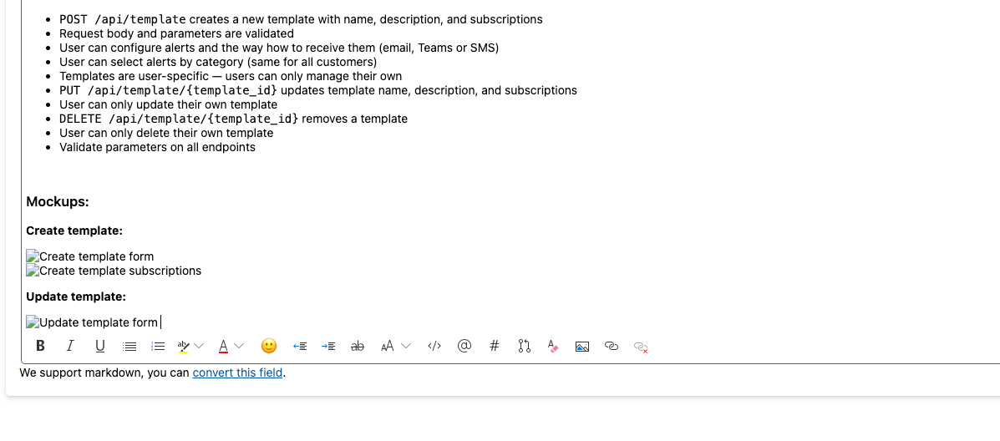
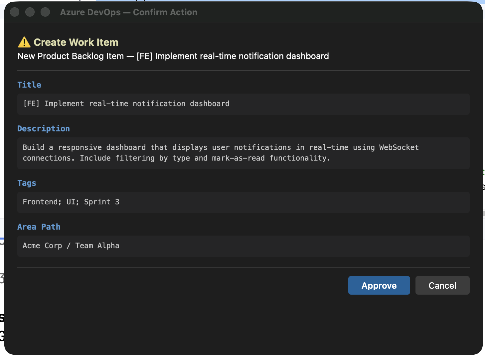

# Azure DevOps Confirmation Hook for Claude Code

Native macOS dialog for reviewing Azure DevOps MCP write operations before they execute. See what's changing, approve or cancel.

| Update — word-level diff | Create — field summary | Batch update — table view |
|:---:|:---:|:---:|
|  |  |  |

## Why

The [Azure DevOps MCP server](https://github.com/anthropics/azure-devops-mcp) lets Claude Code create, update, and link work items directly. But write operations execute immediately — no visual preview of what's about to change.

This hook intercepts MCP write calls and shows a native macOS dialog with:
- **Updates:** side-by-side diff with word-level highlighting
- **Batch updates:** table with old → new values per item
- **Creates:** field summary of the new work item
- **Links, comments, PRs:** formatted preview

## Install

```bash
# 1. Copy files to your project
mkdir -p .claude/hooks
cp hooks/ado-confirm.sh .claude/hooks/
cp hooks/ado-confirm-dialog.py .claude/hooks/
cp hooks/ado-webview.swift .claude/hooks/
chmod +x .claude/hooks/ado-confirm.sh .claude/hooks/ado-confirm-dialog.py

# 2. Compile the native dialog (macOS only)
swiftc -framework Cocoa -framework WebKit -O \
  -o .claude/hooks/ado-webview .claude/hooks/ado-webview.swift

# 3. Add binary to .gitignore
echo ".claude/hooks/ado-webview" >> .gitignore
```

## Configure

Add to `.claude/settings.local.json`:

```json
{
  "hooks": {
    "PreToolUse": [
      {
        "matcher": "mcp__azure-devops__wit_create_work_item|mcp__azure-devops__wit_update_work_item|mcp__azure-devops__wit_update_work_items_batch|mcp__azure-devops__wit_add_child_work_items|mcp__azure-devops__wit_add_work_item_comment|mcp__azure-devops__repo_create_pull_request|mcp__azure-devops__wit_work_items_link|mcp__azure-devops__wit_add_artifact_link|mcp__azure-devops__repo_create_branch",
        "hooks": [
          {
            "type": "command",
            "command": ".claude/hooks/ado-confirm.sh",
            "timeout": 30000,
            "statusMessage": "Awaiting confirmation for Azure DevOps action..."
          }
        ]
      }
    ]
  }
}
```

The hook reads your org name and PAT from `.mcp.json` automatically — no hardcoded config needed.

## How It Works

1. Claude Code calls an Azure DevOps MCP tool (create, update, link, etc.)
2. The hook intercepts the call before execution
3. For updates: fetches current values from Azure DevOps API to show the diff
4. Renders an HTML view in a native macOS WebView window
5. You click **Approve** (or Enter) to proceed, **Cancel** (or Escape) to block

The dialog appears on your current screen — no desktop switching.

## Requirements

- **macOS** (Cocoa WebView)
- **Xcode Command Line Tools** (for `swiftc`)
- **jq**, **curl** (for the shell script)
- Azure DevOps MCP server configured in `.mcp.json`

## Files

| File | What it does |
|------|-------------|
| `ado-confirm.sh` | Hook entry point. Enriches payloads with current values for diffs. |
| `ado-confirm-dialog.py` | Builds HTML for each operation type. Handles diff, batch fetch, name normalization. |
| `ado-webview.swift` | Native macOS window with WKWebView. Renders HTML, handles Approve/Cancel. |

## License

MIT
